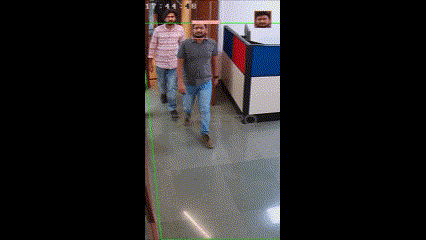

# RJPOLICE_HACK_472_CyberKnights_6
# Project Name: Nazar
# [Video Demonstration _(Click Here)_](https://www.youtube.com/watch?v=sDWuOFIDW-I) 
## Flow

## Front-end Screenshot


## Demo Screenshots
.png)
.png)

## Features

- **Object Detection:** Utilizes YOLOv5 for real-time detection of various objects and events in a given scene.
- **Face Detection:** Using YOLOv5 for real-time face detection in a given scene.
-  
- **Incident Identification:** Focuses on identifying and highlighting instances of violence, riots, crimes, and accidents.
- **Real-Time Processing:** Optimized for processing video streams in real-time.
- **ANPR mounted on vehicle** 
- **Visual Alerts:** Provides visual alerts or annotations for detected incidents.

# ML Models:
## Architecture

## Implement image processing algorithms:

### 1. Vehicle Detection with Number Plate Recognition using YOLOv5:

The YOLO (You Only Look Once) model is a real-time object detection system known for its speed and accuracy. In this project, we have trained YOLOv5 to specifically detect vehicles and recognize their number plates.
  
### View the results:
Detected vehicles and their number plates will be highlighted in the output video.

## 2. Face Matching using ArcFace:

ArcFace is a state-of-the-art face recognition model. The system captures video from a camera source, detects faces, and matches them against a database using ArcFace embeddings.

## 3. Crowd Congestion Detection using CSRNet:

CSRNet is a deep learning model designed for counting and density estimation in crowded scenes. The system captures video from a camera source, processes the frames using CSRNet, and estimates the crowd density, identifying congestion areas.

 **Visualization:** Provides a visual representation of crowd density and congestion areas.

 ## 4. Suspicious Object Detection using YOLOv5:
 
YOLOv5 is a powerful object detection model. The system captures video from a camera source, processes the frames using YOLOv5, and identifies and highlights suspicious objects in real time.

**Visual Alerts:** Provides visual alerts or annotations for detected suspicious objects.

## 5. Detection of Violence, Riots, Crimes, and Accidents using YOLOv5:

YOLOv5 is a state-of-the-art object detection model, to detect and identify instances of violence, riots, crimes, and accidents in video streams. The system captures real-time video from a camera source, processes the frames using YOLOv5, and provides alerts or annotations for the detected incidents.
 
# HOW TO ACCESS DEMO
# Camera Registration System

This project is a Camera Registration System developed using the MEFN stack (MongoDB, Express.js, Flask, Node.js).

## Prerequisites

Before running the application locally, make sure you have the following installed:

- [Node.js](https://nodejs.org/) (including npm)
- [MongoDB](https://www.mongodb.com/try/download/community)

## Getting Started

1. **Clone the repository:**

    ```bash
    git clone https://github.com/your-username/camera-registration-system.git
    cd camera-registration-system
    ```

2. **Install Dependencies:**

    ```bash
    # Install server dependencies
    cd backend
    npm install

    # Install client dependencies
    cd ../frontend
    npm install
    ```

3. **Configure MongoDB:**

    - Make sure MongoDB is running locally.
    - Update the MongoDB connection string in `backend/config/database.js` if needed.

4. **Run the Application:**

    ```bash
    # Start the server (from the 'backend' directory)
    cd backend
    node src/app.js

    # Start the client (from the 'frontend' directory)
    cd ../frontend
    start index.html
    ```

5. **In case it doesn't open:**

    - Open your browser and go to [http://localhost:3000](http://localhost:3000).


## Additional Notes

- The application uses Flask for the frontend, Express.js for the backend, and MongoDB for data storage.
- Make sure to set up the Google Maps API key in the frontend (`frontend/js/script.js`) for map functionality.
- Adjust the paths and configurations as needed for your specific setup.

Feel free to contribute, report issues, or provide feedback!

